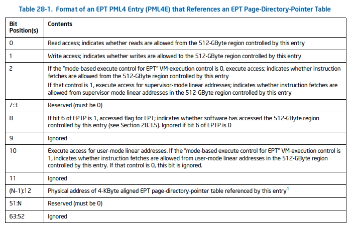
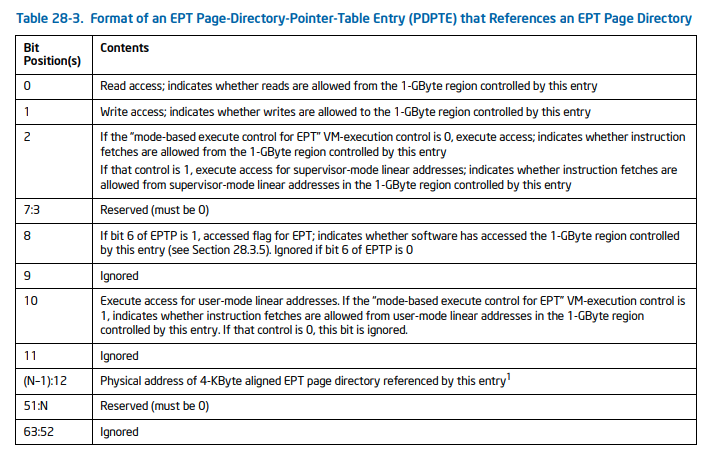
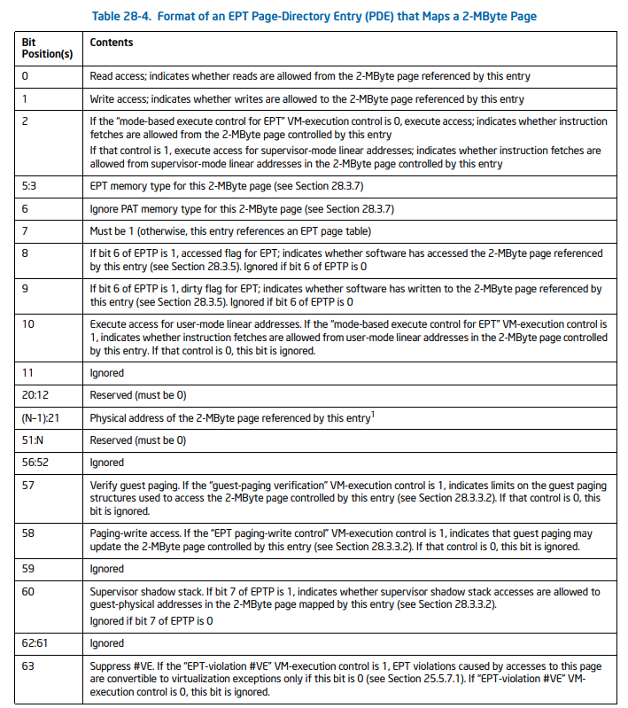
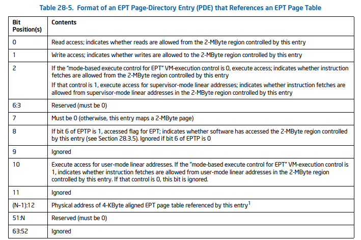
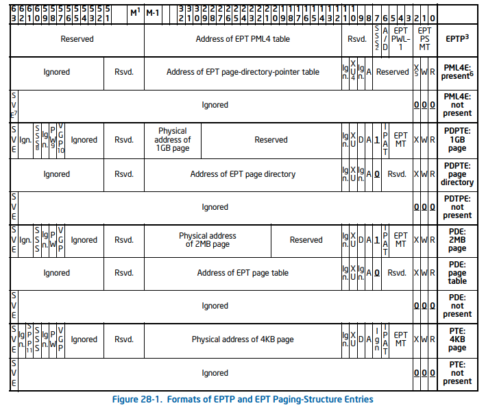

# EPT

Basically, memos are hardcoded in source code.

## EPT Tables specifications

PML4 (`N` is the physical-addr width supported by the processor. in x86-64 of 4-level pagin, `N = 48`):

PDPT (Note that PDPT entry can directly maps 1GB page and the meaning of PDPTE differs in that case, though BitVisor doesn't support 1GB page):

PD (Note that PDE can directly maps 2MB page depending on 7th bit of PDE, which BitVisor supports):

PT

**SUMMARY**

### Notes

- EPT structure is present iff. **any** bits of PTE[2:0] is 1.
